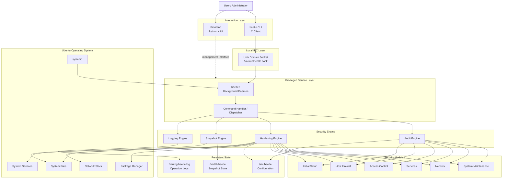
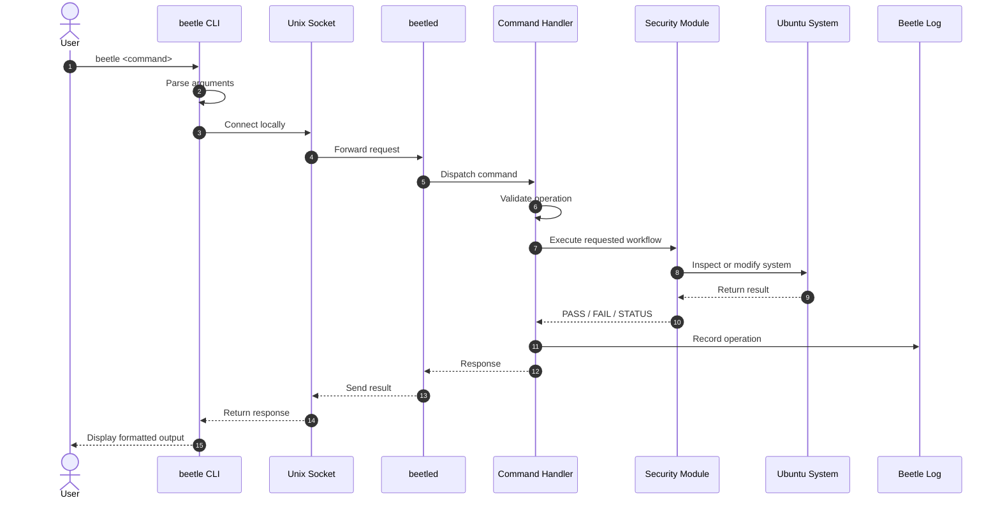
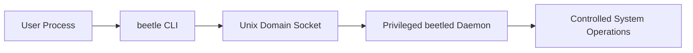
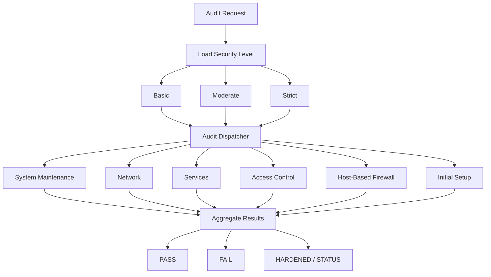
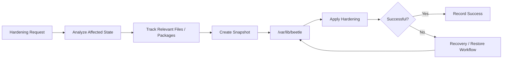
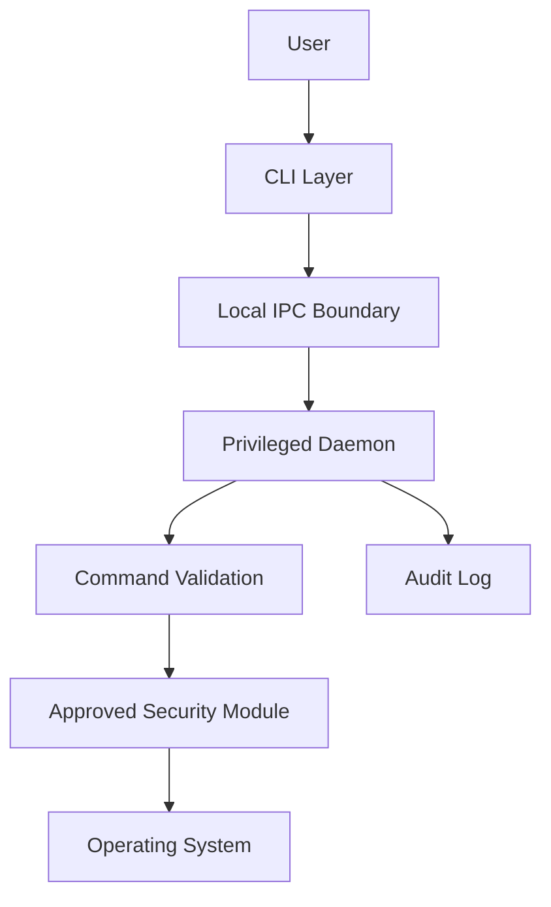

````markdown
<div align="center">

# 🪲 Beetle

### OS Hardening, Auditing, and Recovery for Ubuntu

**Beetle** is a system-level security hardening platform designed to audit, secure, monitor, and recover Ubuntu systems through a command-line interface, privileged background daemon, configurable security policies, and snapshot-based restoration workflows.

It provides a structured way to inspect system security posture, apply hardening controls, preserve system state before sensitive changes, and maintain an auditable record of operations.

<br>


</div>

---

## 📖 Table of Contents

- [Overview](#-overview)
- [Why Beetle?](#-why-beetle)
- [Core Capabilities](#-core-capabilities)
- [Architecture](#-architecture)
- [Request Lifecycle](#-request-lifecycle)
- [Core Components](#-core-components)
- [Audit and Hardening Model](#-audit-and-hardening-model)
- [Snapshot and Recovery Model](#-snapshot-and-recovery-model)
- [Logging and Traceability](#-logging-and-traceability)
- [Repository Structure](#-repository-structure)
- [Technology Stack](#-technology-stack)
- [Installation](#-installation)
- [Usage](#-usage)
- [Configuration](#-configuration)
- [Security Model](#-security-model)
- [Development](#-development)
- [Roadmap](#-roadmap)
- [Contributing](#-contributing)
- [License](#-license)

---

## 🔍 Overview

Operating-system hardening is rarely a single action. A secure host must continuously manage:

- insecure service configurations,
- weak access-control settings,
- unnecessary network exposure,
- firewall policy,
- system maintenance,
- security baselines,
- configuration drift,
- privileged changes,
- rollback and recovery.

Beetle brings these concerns into a unified security workflow.

Instead of relying only on isolated shell commands, Beetle separates user interaction from privileged execution through a **client-daemon architecture**.

The user interacts with the `beetle` command-line client. Privileged operations are handled by the `beetled` background service. Communication between them occurs locally through a Unix domain socket.

This design provides a foundation for:

- centralized privileged execution,
- modular audit logic,
- controlled hardening operations,
- consistent logging,
- snapshot-based recovery,
- future policy and authorization extensions.

---

## 💡 Why Beetle?

Manual hardening often creates several operational problems:

| Problem | Beetle's Approach |
|---|---|
| Security checks are scattered across scripts | Centralized audit workflow |
| Hardening requires repeated privileged commands | Dedicated privileged daemon |
| Changes may be difficult to reverse | Snapshot and recovery workflow |
| Security posture is difficult to understand | Structured PASS / FAIL reporting |
| Different environments require different baselines | Configurable hardening levels |
| Privileged actions lack centralized traceability | Central operation logging |
| Large scripts become difficult to maintain | Modular audit categories |

Beetle aims to make operating-system hardening more **structured, repeatable, observable, and recoverable**.

---

## ✨ Core Capabilities

### 🔎 Security Auditing

Inspect the system against organized security checks and report whether individual controls pass or fail.

Audit areas include categories such as:

- system maintenance,
- network configuration,
- services,
- access control,
- host-based firewall,
- initial system setup.

---

### 🛡️ Configurable Hardening Levels

Beetle supports security profiles that can represent different levels of enforcement:

- **Basic**
- **Moderate**
- **Strict**

This allows security posture to be adapted to different environments instead of forcing every machine into the same baseline.

---

### 🔧 Automated Hardening

Apply security remediations through controlled execution paths.

The hardening workflow is intended to:

1. identify an insecure configuration,
2. determine the relevant remediation,
3. preserve recoverable state where necessary,
4. apply the change,
5. report execution status,
6. record the operation.

---

### 📦 Snapshot and Recovery

Preserve system state before important modifications and maintain metadata required for restoration workflows.

Snapshots can help reduce the operational risk of hardening changes by providing a path toward recovery.

---

### ⚙️ Privileged Background Daemon

`beetled` acts as the privileged execution layer.

This separates:

- **user interaction**
- **system-level modification**

The CLI does not need to embed every privileged operation directly into the user-facing process.

---

### 📝 Centralized Logging

Security-sensitive operations can be recorded with contextual information such as:

- operation identifier,
- process ID,
- user,
- command,
- status,
- timestamp.

---

### 🖥️ Optional Frontend Layer

The repository also contains a Python-based frontend area for presenting Beetle through a graphical interface in addition to terminal-based workflows.

---

# 🏗️ Architecture

Beetle follows a layered architecture centered around a local client-daemon model.



---

# 🔄 Request Lifecycle

A typical Beetle command moves through multiple layers before a privileged action is performed.



### Example Audit Flow

When a user executes:

```bash
beetle audit
```

the conceptual flow is:

```text
User
  │
  ▼
beetle CLI
  │
  │ Local IPC request
  ▼
/var/run/beetle.sock
  │
  ▼
beetled daemon
  │
  ▼
command dispatcher
  │
  ▼
audit engine
  │
  ├── system maintenance checks
  ├── network checks
  ├── service checks
  ├── access-control checks
  ├── firewall checks
  └── initial-setup checks
  │
  ▼
PASS / FAIL results
  │
  ▼
CLI output + operation log
```

---

# 🧩 Core Components

## `beetle` — Command-Line Client

The `beetle` executable is the primary terminal interface.

Responsibilities include:

- parsing user commands,
- validating command-line arguments,
- initiating requests,
- communicating with the local daemon,
- displaying results.

Conceptually:

```bash
beetle audit
beetle harden
beetle snapshot
beetle logs
beetle help
beetle version
```

---

## `beetled` — Background Daemon

`beetled` is the long-running service responsible for privileged backend operations.

Responsibilities include:

- listening for local requests,
- receiving commands,
- dispatching operations,
- invoking backend workflows,
- returning execution results.

It is designed to run under `systemd`.

```text
systemd
   │
   ▼
beetled.service
   │
   ▼
beetled
   │
   ▼
Unix domain socket
```

---

## Unix Domain Socket

The CLI and daemon communicate locally through:

```text
/var/run/beetle.sock
```

A Unix domain socket is suitable for this architecture because communication remains local to the host and can be governed through operating-system ownership and permission controls.



---

## Command Handler

The handler layer connects daemon requests to actual backend operations.

Its role is conceptually similar to a dispatcher:

```text
Incoming command
      │
      ▼
Validate request
      │
      ▼
Identify operation
      │
      ├── audit
      ├── harden
      ├── snapshot
      ├── logs
      └── other supported operations
      │
      ▼
Execute backend workflow
```

---

# 🔐 Audit and Hardening Model

Beetle organizes security checks into logical categories rather than maintaining one monolithic hardening script.



## Security Levels

### Basic

Suitable for environments that need essential security checks while preserving broad compatibility.

### Moderate

A stronger baseline for systems requiring additional protection without maximum restriction.

### Strict

Designed for environments where tighter security controls are preferred and operational compatibility has been reviewed.

---

# 📦 Snapshot and Recovery Model

Hardening changes can affect:

- packages,
- configuration files,
- service behavior,
- networking,
- authentication,
- firewall rules.

Beetle therefore includes a snapshot-oriented workflow for preserving recoverable state.



Snapshot-related state is maintained under:

```text
/var/lib/beetle
```

The snapshot subsystem can maintain metadata associated with tracked packages and affected system state.

This architecture is intended to support safer modification workflows by preserving information required for recovery.

---

# 📝 Logging and Traceability

Security tools should make privileged activity observable.

Beetle maintains operational logging through:

```text
/var/log/beetle.log
```

A log record may capture contextual fields such as:

```text
ID
PID
USER
COMMAND
STATUS
TIME
```

Example conceptual structure:

| Field | Purpose |
|---|---|
| `ID` | Operation identifier |
| `PID` | Process context |
| `USER` | Requesting user |
| `COMMAND` | Requested Beetle operation |
| `STATUS` | Execution outcome |
| `TIME` | Timestamp |

This provides a foundation for:

- debugging,
- operational auditing,
- incident investigation,
- administrative traceability.

---

# 📁 Repository Structure

```text
beetle/
├── frontend/
│   ├── ui/
│   │   └── ...
│   ├── app.py
│   ├── beetle.png
│   └── requirements.txt
│
├── ubuntu/
│   ├── beetle_shell/
│   │   └── ...
│   │
│   ├── config/
│   │   └── ...
│   │
│   ├── etc/
│   │   └── beetle/
│   │       └── ...
│   │
│   ├── beetle.c
│   ├── beetle.conf
│   ├── beetled
│   ├── beetled-handler
│   ├── beetled.c
│   ├── beetled.service
│   ├── install.sh
│   └── ...
│
├── .gitignore
├── LICENSE
└── README.md
```

### Directory Responsibilities

| Path | Responsibility |
|---|---|
| `ubuntu/` | Core Ubuntu hardening implementation |
| `ubuntu/beetle.c` | CLI client implementation |
| `ubuntu/beetled.c` | Daemon implementation |
| `ubuntu/beetled.service` | systemd service definition |
| `ubuntu/beetled-handler` | Command dispatch and backend execution |
| `ubuntu/beetle_shell/` | Modular shell-based security logic |
| `ubuntu/config/` | Configuration resources |
| `ubuntu/etc/beetle/` | Beetle system configuration layout |
| `frontend/` | Python-based graphical interface |
| `frontend/app.py` | Frontend application entry point |

---

# 🛠️ Technology Stack

| Technology | Role |
|---|---|
| **C** | CLI client and daemon implementation |
| **Shell / Bash** | Audit and hardening automation |
| **Python** | Frontend application layer |
| **Unix Domain Sockets** | Local client-daemon IPC |
| **systemd** | Daemon lifecycle management |
| **JSON** | Configuration and metadata |
| **Ubuntu Linux** | Primary target operating system |

---

# 🚀 Installation

## Prerequisites

Before installing Beetle, ensure that the target system provides:

- Ubuntu Linux
- GCC or a compatible C compiler
- Bash
- systemd
- root or sudo access

Clone the repository:

```bash
git clone https://github.com/the404packet/beetle.git
cd beetle
```

Move into the Ubuntu implementation:

```bash
cd ubuntu
```

Make the installer executable:

```bash
chmod +x install.sh
```

Run the installer:

```bash
sudo ./install.sh
```

---

## Verify the Service

Check whether the Beetle daemon is running:

```bash
systemctl status beetled
```

Start it manually if required:

```bash
sudo systemctl start beetled
```

Enable it at boot:

```bash
sudo systemctl enable beetled
```

---

# 💻 Usage

## Display Help

```bash
beetle help
```

## Run a Security Audit

```bash
beetle audit
```

## Apply Hardening

```bash
beetle harden
```

## Work With Snapshots

```bash
beetle snapshot
```

## Inspect Logs

```bash
beetle logs
```

## Display Version

```bash
beetle version
```

> Exact command options may vary according to the currently implemented CLI command set.

---

# ⚙️ Configuration

Beetle configuration is stored under:

```text
/etc/beetle
```

Configuration can define behavior such as:

- selected hardening level,
- enabled security categories,
- audit behavior,
- hardening policy,
- module-specific settings.

Conceptual profile example:

```json
{
  "level": "moderate",
  "categories": {
    "system_maintenance": true,
    "network": true,
    "services": true,
    "access_control": true,
    "host_based_firewall": true,
    "initial_setup": true
  }
}
```

> Refer to the actual configuration files in the repository for currently supported keys and values.

---

# 🛡️ Security Model

Beetle's architecture is designed around separation of responsibilities.



## Security Principles

### Least Privilege

User-facing processes should not perform unrestricted privileged work when the operation can be delegated to a controlled backend service.

### Local IPC

The Unix domain socket keeps client-daemon communication local to the host.

### Centralized Privileged Execution

Sensitive system modifications pass through the daemon layer rather than being independently implemented by every client.

### Traceability

Operations can be recorded for later inspection.

### Recoverability

Snapshot workflows help reduce the risk associated with security configuration changes.

### Modular Enforcement

Security checks are divided into categories, making them easier to inspect, maintain, and extend.

---

# 🧪 Development

Clone the repository:

```bash
git clone https://github.com/the404packet/beetle.git
cd beetle
```

Move into the Ubuntu implementation:

```bash
cd ubuntu
```

Compile the client:

```bash
gcc beetle.c -o beetle
```

Compile the daemon:

```bash
gcc beetled.c -o beetled
```

Run development checks carefully in a disposable Ubuntu environment.

> ⚠️ Beetle performs operating-system security operations. Development and testing should preferably be done inside a VM, lab machine, or other recoverable environment.

---

# 🗺️ Roadmap

Potential future directions include:

- [ ] Additional Linux distribution support
- [ ] Expanded security baselines
- [ ] CIS-aligned policy profiles
- [ ] Richer snapshot restoration workflows
- [ ] Fine-grained authorization policies
- [ ] Improved frontend management experience
- [ ] Machine-readable audit reports
- [ ] Exportable compliance reports
- [ ] Scheduled security audits
- [ ] Configuration drift detection
- [ ] Remote fleet management
- [ ] Plugin-based security modules
- [ ] Enhanced test coverage
- [ ] CI-based security validation

---

# 🤝 Contributing

Contributions are welcome.

## 1. Fork the Repository

Create your own fork of the project.

## 2. Clone Your Fork

```bash
git clone https://github.com/<your-username>/beetle.git
cd beetle
```

## 3. Create a Feature Branch

```bash
git checkout -b feature/your-feature-name
```

## 4. Make Your Changes

Follow the existing project structure and keep security modules focused and maintainable.

## 5. Commit Your Changes

```bash
git commit -m "feat: add your feature"
```

## 6. Push the Branch

```bash
git push origin feature/your-feature-name
```

## 7. Open a Pull Request

Describe:

- what changed,
- why the change is needed,
- how it was tested,
- whether it affects privileged operations,
- whether rollback behavior was considered.

---

# ⚠️ Disclaimer

Beetle modifies operating-system security configuration.

Hardening actions may affect:

- networking,
- authentication,
- installed packages,
- firewall behavior,
- system services,
- remote access,
- application compatibility.

Always review security changes before applying them to production systems.

Testing in a virtual machine or recoverable environment is strongly recommended.

---

<div align="center">

## 🪲 Beetle

**Audit. Harden. Recover.**

Built for structured Ubuntu security hardening.

</div>
````
